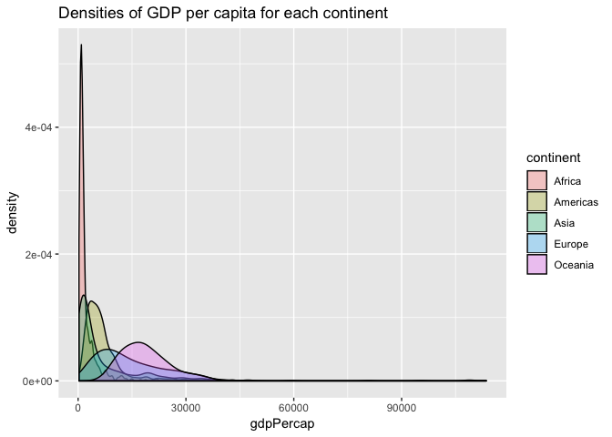
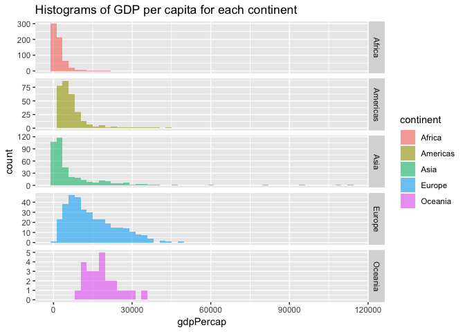
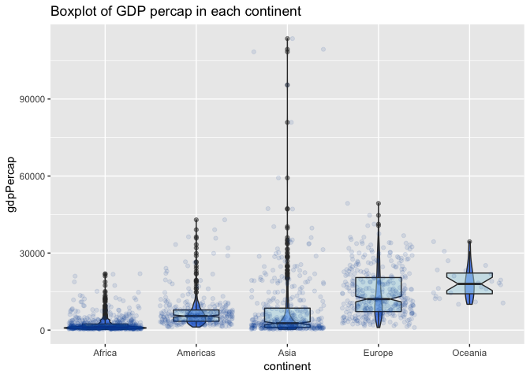
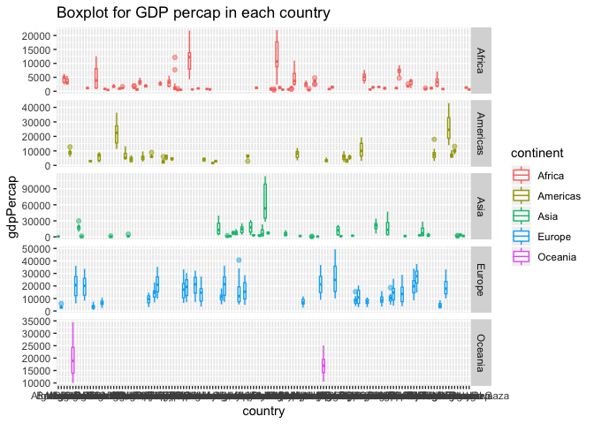
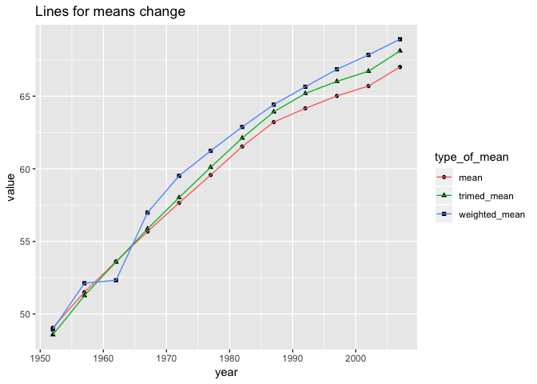
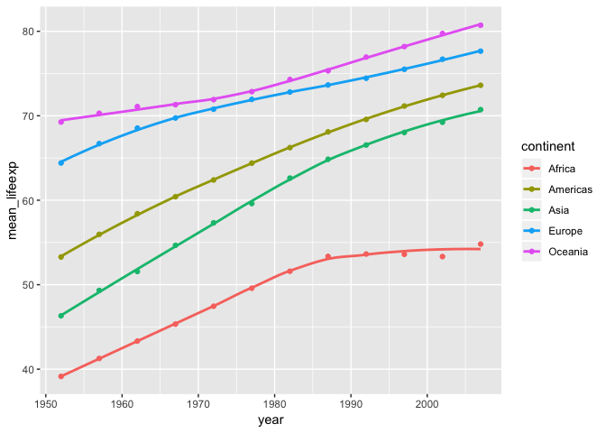
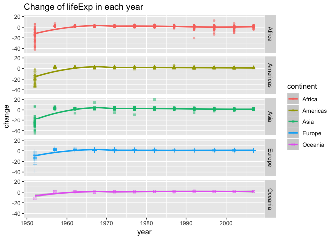

Use dplyr/ggplot2 to manipulate and explore data
================
Zuheng(David) Xu
2018-09-30

Introduction
------------

In this assignmentm, I intended to get a deeper dive into using `dylyr` and `ggplot2` to manipulate and visualize data.

Here are all the packages would be used:

``` r
library(tidyverse)
library(gapminder)
library(ggplot2)
library(knitr)
```

I will choose several tasks from the task menu:

-   Get the maximum and minimum of GDP per capita for all continents.
-   Look at the spread of GDP per capita within the continents.
-   Compute a trimmed mean of life expectancy for different years. Or a weighted mean, weighting by population. Just try something other than the plain vanilla mean.
-   How is life expectancy changing over time on different continents.

Task menu
---------

### (1) Get the maximum and minimum of GDP per capita for all continents

I summarize the grouped data and generate a table to show the max and min GDP percapita in each continent.

``` r
gapminder %>% 
  group_by(continent) %>% 
  summarize(Min= min(gdpPercap),
            Max=max(gdpPercap)) %>% 
  knitr::kable()
```

| continent |         Min|        Max|
|:----------|-----------:|----------:|
| Africa    |    241.1659|   21951.21|
| Americas  |   1201.6372|   42951.65|
| Asia      |    331.0000|  113523.13|
| Europe    |    973.5332|   49357.19|
| Oceania   |  10039.5956|   34435.37|

The data visualization will be shown in the next section by using boxplot.

### (2) Look at the spread of GDP per capita within the continents

First of all, let's have a general opinion by density graph.

``` r
#multiple density of gdpPercap grouped by continent
ggplot(gapminder, aes(gdpPercap, fill= continent)) +
  geom_density(alpha=0.3) +
  labs( title="Densities of GDP per capita for each continent")
```



``` r
# we can also using facet_grid
ggplot(gapminder, aes(gdpPercap, fill= continent)) +
  geom_histogram(alpha=0.6,bins=50) +
  labs( title="Histograms of GDP per capita for each continent")+
  facet_grid(continent~.,scales = "free_y")
```



It's obvious that huge difference of the distribution between cosntinents exists. For example, Africa has lower GDP per capita and smaller variantion, while Oceania shows higher GDP per capita and wider spread.

Then, we can explore more details such as median mean and IQR by using side\_by\_side box plot.

``` r
#jitter plot + boxplot + violin, factored by continent

gapminder %>% 
  group_by(continent) %>% 
  ggplot(aes(continent,gdpPercap))+
  geom_violin(fill="cornflowerblue")+
  geom_boxplot(fill= "lightblue",width=0.5,alpha=0.5,notch=TRUE)+
  geom_jitter(col="#0353A4", alpha= 0.1)+
  labs(title="Boxplot of GDP percap in each continent")
```



It's interesting that even though Asia has low GDP percapita over all, there are several rich countries leading the whole world. Also, continents with lower GDP percap tend to have more outliers, which inspire us to see the box plot in each country.

``` r
#boxplot, factored by country, grouped by continent
gapminder %>% 
  ggplot(aes(country,gdpPercap,color=continent,shape=continent))+
  geom_boxplot(alpha=0.5)+
  facet_grid(continent~.,scale="free_y")+
  labs(title="Boxplot for GDP percap in each country")
```



Lastly, I will use a table to show some numeric statistics about GDP percap in each continent.

``` r
#table for numerical statistics
gapminder %>% 
  group_by(continent) %>% 
  summarize(Min=min(gdpPercap),
            Mean=mean(gdpPercap),
            Median = median(gdpPercap),
            IQR= IQR(gdpPercap),
            Max= max(gdpPercap)
) %>% 
  knitr::kable()
```

| continent |         Min|       Mean|     Median|        IQR|        Max|
|:----------|-----------:|----------:|----------:|----------:|----------:|
| Africa    |    241.1659|   2193.755|   1192.138|   1616.170|   21951.21|
| Americas  |   1201.6372|   7136.110|   5465.510|   4402.431|   42951.65|
| Asia      |    331.0000|   7902.150|   2646.787|   7492.262|  113523.13|
| Europe    |    973.5332|  14469.476|  12081.749|  13248.301|   49357.19|
| Oceania   |  10039.5956|  18621.609|  17983.304|   8072.258|   34435.37|

### (3) Mean `LifeExp` computation

The requirement for the mean computation is:

> Compute a trimmed mean of life expectancy for different years. Or a weighted mean, weighting by population. Just try something other than the plain vanilla mean.

Therefore, in this seciton, I will apply 3 computations of life expectancy: trimmed/weighted/normal mean of life expectancy for different years. and visualize the data with `ggoplot2`.

``` r
#calculation 

#trimed data(10% of the ends discarded) 
trim= gapminder %>% 
  group_by(year) %>% 
  summarize(trimed_mean = mean(lifeExp,trim= 0.1)) %>% 
              arrange(year)

#normal mean            
norm= gapminder %>% 
  group_by(year) %>% 
  summarize(mean = mean(lifeExp)) %>% 
              arrange(year)
#weighted by population
weight=gapminder %>% 
  group_by(year) %>% 
  summarize(weighted_mean = weighted.mean(lifeExp,pop))%>% 
              arrange(year)
```

``` r
#bind into 1 data and generate a table
# store as a because i will plot this table
a= cbind(norm, trim$trimed_mean,weight$weighted_mean) %>% 
  rename("trimed_mean"="trim$trimed_mean","weighted_mean"="weight$weighted_mean")


a %>% knitr::kable()
```

|  year|      mean|  trimed\_mean|  weighted\_mean|
|-----:|---------:|-------------:|---------------:|
|  1952|  49.05762|      48.57668|        48.94424|
|  1957|  51.50740|      51.26888|        52.12189|
|  1962|  53.60925|      53.58075|        52.32438|
|  1967|  55.67829|      55.86538|        56.98431|
|  1972|  57.64739|      58.01444|        59.51478|
|  1977|  59.57016|      60.10206|        61.23726|
|  1982|  61.53320|      62.11694|        62.88176|
|  1987|  63.21261|      63.92106|        64.41635|
|  1992|  64.16034|      65.18519|        65.64590|
|  1997|  65.01468|      66.01736|        66.84934|
|  2002|  65.69492|      66.71641|        67.83904|
|  2007|  67.00742|      68.11489|        68.91909|

To see the tendency of the change of the means, I will use line graph to illustrate.

``` r
#using gather function ,then group
a %>% 
  gather(key="type_of_mean",value="value", contains("mean")) %>% 
  group_by(as.factor(type_of_mean))%>% 
  ggplot(aes(year,value))+geom_point(aes(shape=type_of_mean)) + geom_line(aes(color=type_of_mean))+
  labs(title= "Lines for means change")
```



### (4) How is life expectancy changing over time on different continents

First of all, I'll present the mean of `lifeExp` each year each continent into a table.Since the table is too long, it will be hide.

``` r
#table of mean lifeexp grrouped by year and continent
b=gapminder %>% 
  group_by(continent,year) %>% 
  summarize(mean_lifeexp= mean(lifeExp)) 
b %>% 
  knitr::kable()
```

| continent |  year|  mean\_lifeexp|
|:----------|-----:|--------------:|
| Africa    |  1952|       39.13550|
| Africa    |  1957|       41.26635|
| Africa    |  1962|       43.31944|
| Africa    |  1967|       45.33454|
| Africa    |  1972|       47.45094|
| Africa    |  1977|       49.58042|
| Africa    |  1982|       51.59287|
| Africa    |  1987|       53.34479|
| Africa    |  1992|       53.62958|
| Africa    |  1997|       53.59827|
| Africa    |  2002|       53.32523|
| Africa    |  2007|       54.80604|
| Americas  |  1952|       53.27984|
| Americas  |  1957|       55.96028|
| Americas  |  1962|       58.39876|
| Americas  |  1967|       60.41092|
| Americas  |  1972|       62.39492|
| Americas  |  1977|       64.39156|
| Americas  |  1982|       66.22884|
| Americas  |  1987|       68.09072|
| Americas  |  1992|       69.56836|
| Americas  |  1997|       71.15048|
| Americas  |  2002|       72.42204|
| Americas  |  2007|       73.60812|
| Asia      |  1952|       46.31439|
| Asia      |  1957|       49.31854|
| Asia      |  1962|       51.56322|
| Asia      |  1967|       54.66364|
| Asia      |  1972|       57.31927|
| Asia      |  1977|       59.61056|
| Asia      |  1982|       62.61794|
| Asia      |  1987|       64.85118|
| Asia      |  1992|       66.53721|
| Asia      |  1997|       68.02052|
| Asia      |  2002|       69.23388|
| Asia      |  2007|       70.72848|
| Europe    |  1952|       64.40850|
| Europe    |  1957|       66.70307|
| Europe    |  1962|       68.53923|
| Europe    |  1967|       69.73760|
| Europe    |  1972|       70.77503|
| Europe    |  1977|       71.93777|
| Europe    |  1982|       72.80640|
| Europe    |  1987|       73.64217|
| Europe    |  1992|       74.44010|
| Europe    |  1997|       75.50517|
| Europe    |  2002|       76.70060|
| Europe    |  2007|       77.64860|
| Oceania   |  1952|       69.25500|
| Oceania   |  1957|       70.29500|
| Oceania   |  1962|       71.08500|
| Oceania   |  1967|       71.31000|
| Oceania   |  1972|       71.91000|
| Oceania   |  1977|       72.85500|
| Oceania   |  1982|       74.29000|
| Oceania   |  1987|       75.32000|
| Oceania   |  1992|       76.94500|
| Oceania   |  1997|       78.19000|
| Oceania   |  2002|       79.74000|
| Oceania   |  2007|       80.71950|

A graph would help to illustrate the change by year.

``` r
b %>% 
  ggplot(aes(year,mean_lifeexp,color= continent)) +
  geom_smooth(se =FALSE,size=1)+
  geom_point()
```

    ## `geom_smooth()` using method = 'loess' and formula 'y ~ x'



Then, I calculated the exact change in each year.

``` r
gapminder %>% 
  group_by(continent) %>% 
  mutate(change = lifeExp -lag(lifeExp,1)) %>%
  drop_na() %>%  #since there is NA in first year
  ggplot(aes(year,change,color =continent,shape=continent))+
  geom_smooth() + geom_point(alpha=0.5)+
  facet_grid(continent~.)+
  labs(title="Change of lifeExp in each year")
```

    ## `geom_smooth()` using method = 'loess' and formula 'y ~ x'



We can see that the change of life expectancy for all continents is around 0 after 1960. For Americas,Europe and Ocieania, the change of each country is consitent, while other 2 continents have much wider variation between countries.
